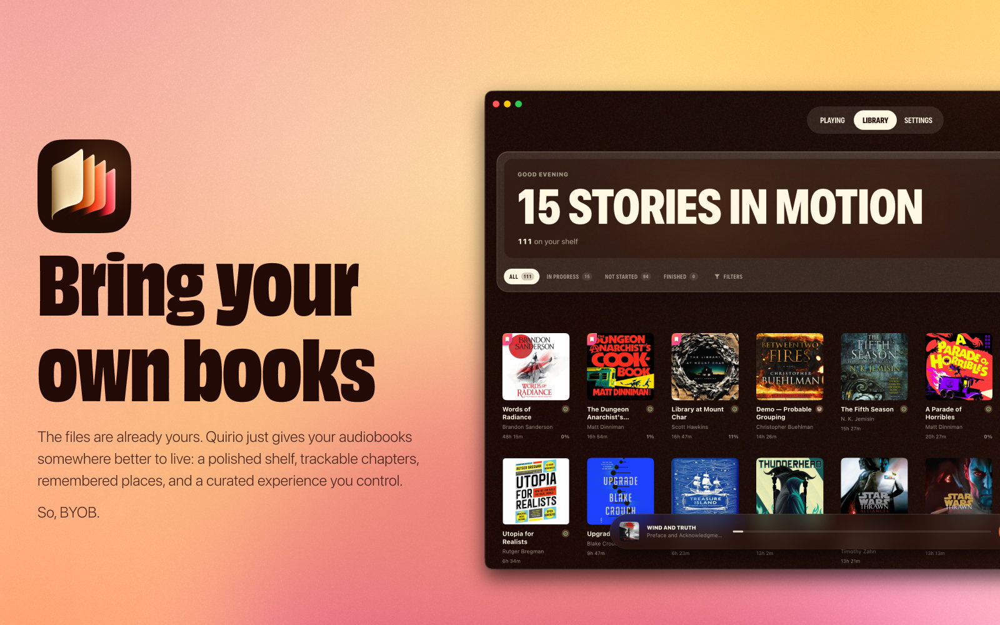
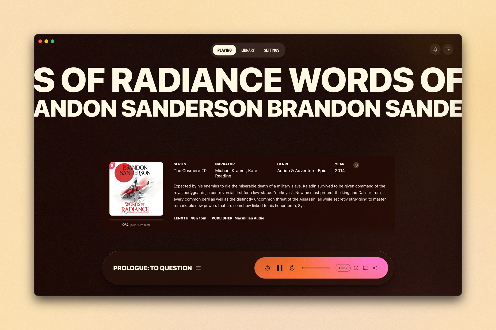
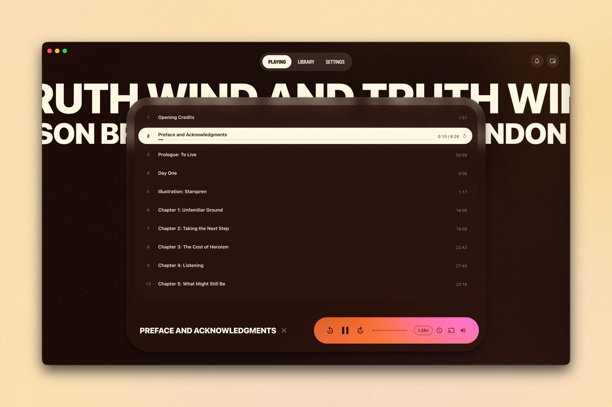
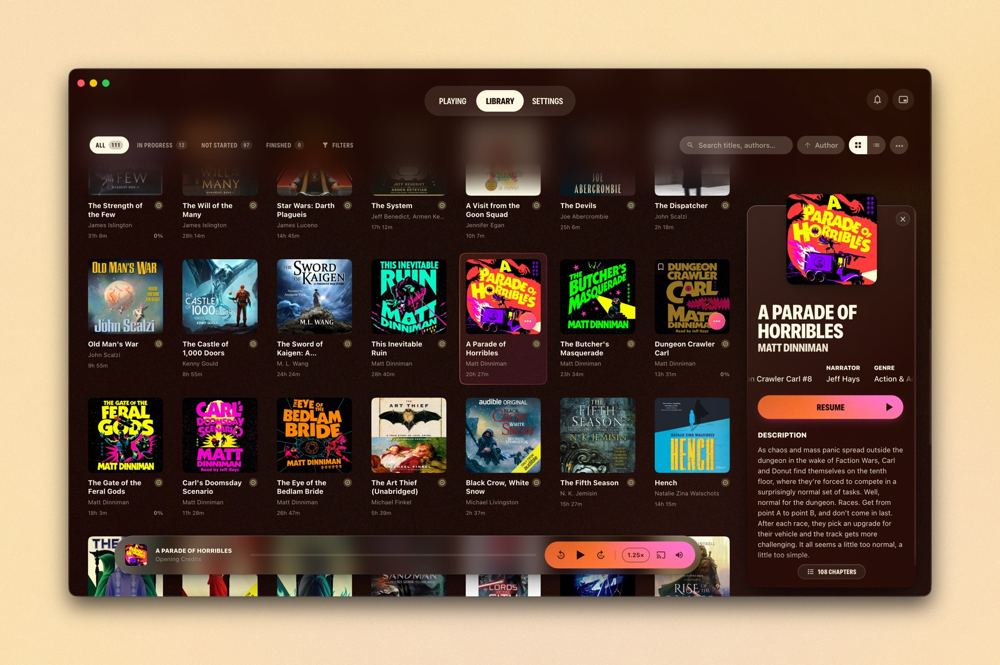
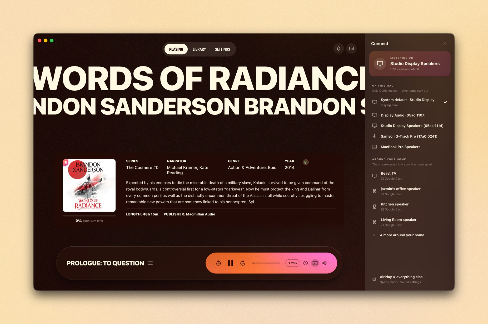
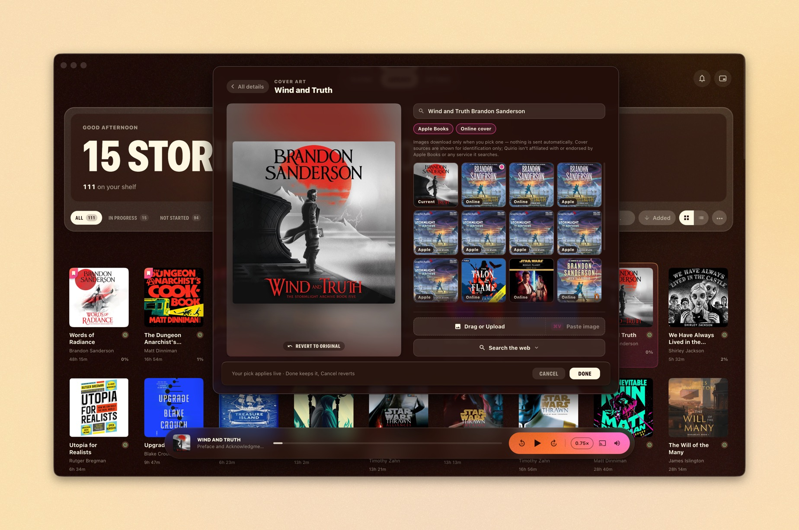
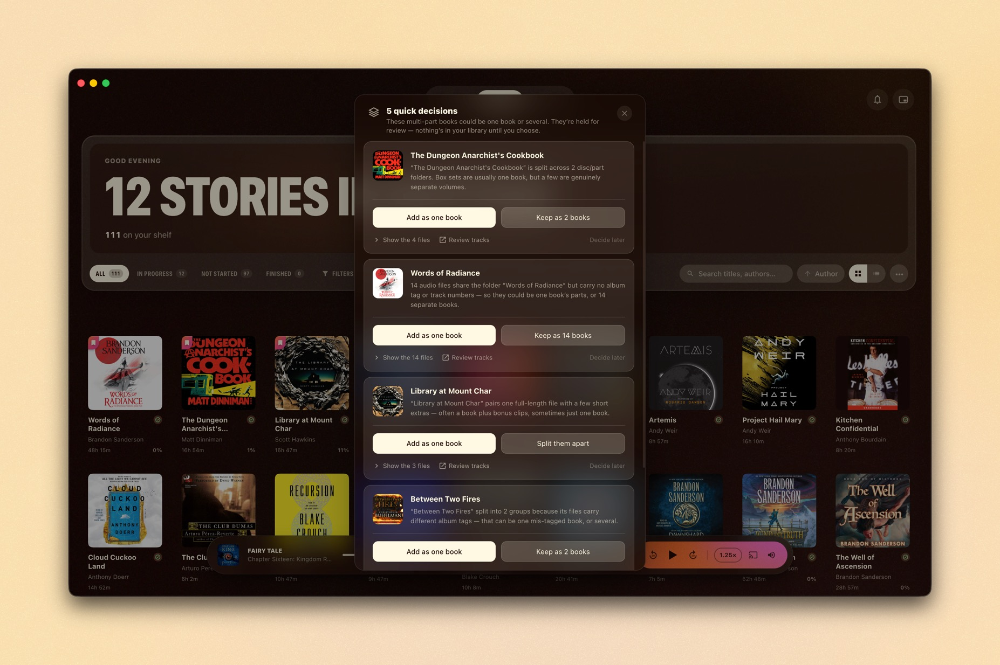
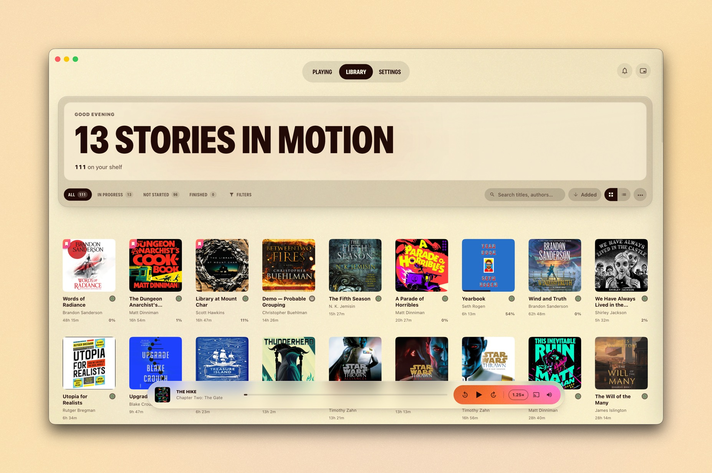
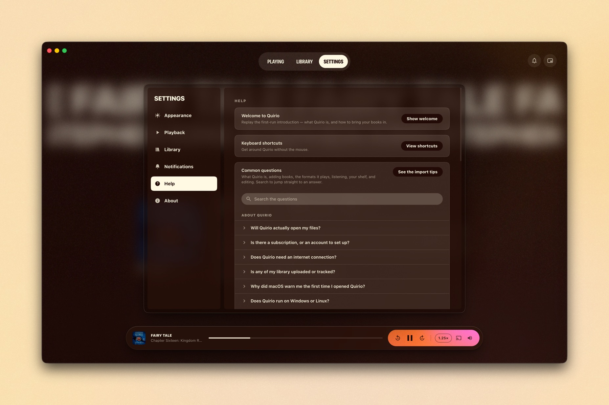
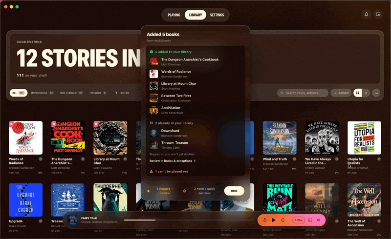

<a id="readme-top"></a>

<div align="center">

  <picture>
    <source media="(prefers-color-scheme: dark)" srcset="docs/assets/logo-dark.png">
    <source media="(prefers-color-scheme: light)" srcset="docs/assets/logo-light.png">
    
  </picture>

  <br/>
  <br/>

  **Bring your own books.**

  A beautiful, offline audiobook player for Mac, built for the library you assembled yourself.<br/>
  DRM-free, exported, gathered from wherever. No store, no subscription, no account.

  <br/>

  [](https://github.com/theglimmerman/quirio-app/releases/latest)

  &nbsp;

  
  
  
  

  <sub>[Download](#install) · [What it does](#why-quirio) · [Bringing your books in](#getting-started) · [FAQ](#faq) · [Privacy](#privacy)</sub>

</div>

<br/>

<div align="center">
  
</div>

<br/>

> Quirio is the player for audiobooks you sourced yourself — and it gets out of the way so you can listen. It opens your files, remembers your place, and keeps everything on your Mac. The audiobooks you own, somewhere they’re glad to be.

<br/>

> [!NOTE]
> **One honest thing up front.** Quirio plays audiobooks that are already *yours to play* — DRM-free files, not locked to anyone else’s app. It isn’t a converter and it doesn’t strip DRM: if your books are still tied to Audible or Apple Books, Quirio can’t open them as they are. Getting to a DRM-free copy is a separate step with its own tools, and how you do that is your business — Quirio is simply the home it lands in. New to all this? **[Where DRM-free audiobooks come from →](#finding-drm-free-audiobooks)**

<br/>

<details>
  <summary><b>Contents</b></summary>

- [Why Quirio](#why-quirio)
- [Highlights](#highlights)
- [Screenshots](#screenshots)
- [Install](#install)
  - [Requirements](#requirements)
  - [Download](#1-download)
  - [Open it the first time (the macOS warning)](#2-open-it-the-first-time)
  - ["Quirio is damaged" — the quick fix](#if-you-see-quirio-is-damaged)
  - [Verify your download (optional)](#verify-your-download-optional)
- [Getting started](#getting-started)
- [Keyboard shortcuts](#keyboard-shortcuts)
- [Privacy](#privacy)
- [FAQ](#faq)
- [What’s new](#whats-new)
- [License](#license)
- [The story behind Quirio](#the-story-behind-quirio)
- [Built with](#built-with)

</details>

---

## Why Quirio

You did the work. You tracked down the DRM-free editions, exported the library you’d paid into, freed the books you wanted to actually keep. You’ve got a real collection — files and all.

And then comes the strange part: there’s nowhere good to play them.

The polished apps are storefronts in disguise — subscribe here, license that — and they won’t so much as open a file you brought yourself. The ones that *will* take your files are clunky, half-abandoned, or barely exist, because an app for people who own their audiobooks is, apparently, “too niche.” So a library you worked hard to assemble ends up sitting in a folder somewhere, unplayed and unloved.

That’s the gap Quirio fills. It’s not a market and it’s not a subscription. It’s the well-made room your audiobooks have been missing — one that opens your files, respects that they’re yours, and then gets out of the way so you can listen.

<div align="right"><a href="#readme-top"><sub>↑ back to top</sub></a></div>

## Highlights

|  | |
|---|---|
| 📂 **It opens your files** | Bought DRM-free, exported, or otherwise made yours — Quirio plays the library other apps won’t. Drag in M4B, MP3, or M4A (plus FLAC, OGG, and Opus), and it quietly converts Apple Lossless so it just plays. |
| 🔖 **Never loses your place** | Your spot, your speed, and your chapter, remembered across your whole library. Close the lid mid-sentence; open it tomorrow and you’re right back in. |
| 🔒 **Yours and private** | No account, no subscription, no cloud. Everything lives on your Mac, offline — nothing uploaded, nothing tracked, nothing to renew. |
| 🎧 **Listen anywhere** | Send just Quirio’s audio to AirPods or desk speakers, or hand a book to a Google Cast speaker across the house. Media keys, AirPods controls, and a pinned mini-player keep it close while you work. |
| 🧹 **It tidies up after you** | Reads chapters and cover art, sorts a real shelf, and — when a box set or CD rip is unclear — asks one quick question instead of guessing. It never moves or rewrites your originals. |
| ✍️ **Make it yours** | Fix a title, find a sharper cover (search online, paste your own, or drag one in), and mark the books you love or have finished. Every edit layers on top — your files are never rewritten. |
| 💾 **Your whole library travels** | Back up covers, edits, finished and favorite marks, and progress to a single file — or let Quirio do it daily, to iCloud or a drive. Move to a new Mac and your shelf comes with you. |
| 🖥 **Made for the Mac** | It feels like it belongs on your machine — quick, quiet, fully keyboard-driven, calm in light or dark, with a details panel that slides in the moment you click a book. |

<div align="right"><a href="#readme-top"><sub>↑ back to top</sub></a></div>

## Screenshots

<table>
  <tr>
    <td width="50%"><br/><sub><b>Now Playing</b> — cover, details, and a calm gradient transport bar with speed, chapters, sleep timer, and Listen on.</sub></td>
    <td width="50%"><br/><sub><b>Chapters</b> — jump anywhere; your exact place is always kept.</sub></td>
  </tr>
  <tr>
    <td><br/><sub><b>Details panel</b> — click a book to look before you commit, then Resume (or set a click to play straight away).</sub></td>
    <td><br/><sub><b>Listen on</b> — this Mac, or a speaker around your home.</sub></td>
  </tr>
  <tr>
    <td><br/><sub><b>Covers, your way</b> — search online, paste, upload, or drag one in — non-destructively.</sub></td>
    <td><br/><sub><b>Quick decisions</b> — when a set is ambiguous, Quirio asks instead of guessing.</sub></td>
  </tr>
  <tr>
    <td><br/><sub><b>Light mode</b> — the same shelf, warm and easy on the eyes.</sub></td>
    <td><br/><sub><b>Help that talks like a person</b> — a searchable FAQ, right in the app.</sub></td>
  </tr>
</table>

<div align="center">
  
  <br/><sub>Scan a folder, browse your shelf, press play.</sub>
</div>

<div align="right"><a href="#readme-top"><sub>↑ back to top</sub></a></div>

## Install

### Requirements

- **macOS Tahoe (26)** — what Quirio was built and tested on. Earlier versions may run it, but they aren’t tested yet.
- **Apple Silicon** — M1, M2, M3, or M4 *(Intel builds aren’t available yet)*
- About **300 MB** for the app, plus room for your audiobooks

### 1. Download

Download the latest **`Quirio-x.y.z.dmg`** from the releases page:

**➜ [Download the latest release](https://github.com/theglimmerman/quirio-app/releases/latest)**

Open the `.dmg` and drag **Quirio** onto the **Applications** folder.

### 2. Open it the first time

Quirio is a free hobby project and is currently an **unsigned beta** — it hasn’t been through Apple’s paid notarization yet. So on first launch, macOS plays it safe and shows a warning like *“Apple could not verify Quirio is free of malware.”* **This is expected, and it doesn’t mean anything is wrong.** Here’s the one-time step:

1. In **Applications**, double-click **Quirio**. macOS blocks it — that’s fine, click **Done**.
2. Open  **System Settings → Privacy &amp; Security**.
3. Scroll down to the **Security** section. You’ll see *“Quirio was blocked to protect your Mac.”* Click **Open Anyway**.
4. Confirm with **Open Anyway**, then enter your Mac password (or Touch ID).

That’s it — Quirio opens, and every launch after this is a normal double-click.

> 💡 The **Open Anyway** button only appears for about an hour after you *try* to open the app, so do step 1 first. (If you remember the old **right-click → Open** trick — macOS retired it a few versions back.)

### If you see “Quirio is damaged”

Downloads of **v0.5.0 and earlier** show *“Quirio is damaged and can’t be opened”* instead of the warning above. The app isn’t damaged — those early builds had a packaging bug (fixed since) that made macOS misread the download. The clean fix is to grab the **[latest release](https://github.com/theglimmerman/quirio-app/releases/latest)**. To rescue an older copy instead, clear its quarantine flag in one line:

1. Open **Terminal** (Applications → Utilities → Terminal).
2. Paste this and press **Return**:
   ```sh
   xattr -dr com.apple.quarantine /Applications/Quirio.app
   ```
3. Open Quirio normally.

> Only run commands like this for apps you trust and downloaded yourself. The warning disappears for good once Quirio ships **signed &amp; notarized**.

### Verify your download (optional)

Each release ships a `SHA256SUMS.txt`. To confirm your `.dmg` arrived intact:

```sh
cd ~/Downloads
shasum -a 256 -c SHA256SUMS.txt
```

You want to see `Quirio-x.y.z.dmg: OK`.

<div align="right"><a href="#readme-top"><sub>↑ back to top</sub></a></div>

## Getting started

**1. Bring your books in.** Two ways, and Quirio is clear about the difference:

- **Scan a folder** *(recommended)* — point Quirio at a folder you keep. Your books come in right where they live, and Quirio watches the folder for new arrivals. Nothing is copied or moved.
- **Import files** — hand it a stray book or two; it copies them into your library folder so they stay put.

> A book is **one file** (a single M4B/MP3/M4A with chapters inside) **or one folder** (a CD rip / loose chapter files kept together). Quirio reads one folder as one book.

**2. Press play.** Click a book and a **details panel** slides in — cover, length, chapters, and a play button — so you can have a look before you commit (prefer a click to start playing? that’s a setting). The full Now Playing view has adjustable speed (0.5×–3×), skip controls, a sleep timer (5–90 min), and **Listen on** to send audio to other speakers.

**3. It stays yours.** Everything is local. Edits are non-destructive — your original files are never rewritten — missing files relink in a click, and you can back up your whole library (covers, edits, finished and favorite marks, and progress) from **Settings → Library**, by hand or automatically each day.

> If you’re still building a DRM-free library, Quirio plays files that are yours to play — not ones tied to another app. See **[Finding DRM-free audiobooks](#finding-drm-free-audiobooks)** below for where to look.

The in-app **Settings → Help** has a walkthrough and a searchable FAQ — adding books, supported formats, listening, and more — whenever you want it.

<div align="right"><a href="#readme-top"><sub>↑ back to top</sub></a></div>

## Keyboard shortcuts

Quirio is built to run from the keyboard. A few of the essentials:

| Action | Shortcut | | Action | Shortcut |
|---|---|---|---|---|
| Now Playing | `⌘1` | | Play / pause | `Space` |
| Library | `⌘2` | | Skip back / forward | `←` `→` |
| Search your library | `⌘F` | | Previous / next chapter | `[` `]` |
| Scan a folder | `⇧⌘O` | | Mini player | `⇧⌘M` |
| Import files | `⌘O` | | Keyboard shortcuts | `⌘/` |

<sub>Media keys, AirPods, and Control Center work too.</sub>

<div align="right"><a href="#readme-top"><sub>↑ back to top</sub></a></div>

## Privacy

Quirio is **local and offline**, by nature rather than as a feature.

- No account, no sign-in, nothing to renew.
- Your library — metadata, covers, and progress — stays on your Mac. Your audio files stay wherever you keep them.
- Nothing about your library or your listening is uploaded or tracked.
- The only time anything touches the internet is if *you* turn on optional online cover-art lookup and *you* pick a cover to download.

<div align="right"><a href="#readme-top"><sub>↑ back to top</sub></a></div>

## FAQ

*(The in-app **Settings → Help** has the full, searchable version — this is the short version.)*

### About Quirio

<details>
  <summary><b>Will Quirio actually open my files?</b></summary><br/>
  That’s the whole reason it exists. Drag in the audiobooks you own — an <b>M4B</b>, <b>MP3</b>, or <b>M4A</b> — and they just play. No account, no sign-in, no “this title isn’t available.” Quirio is a player for the library you built yourself, not a store with something to sell you.
</details>

<details>
  <summary><b>Is there a subscription, or an account to set up?</b></summary><br/>
  No, and no — that’s rather the point. Quirio is <b>free for personal use</b>, with nothing to renew and nobody to sign up with. You did the work to own these books; the app that plays them has no business putting a meter on it.
</details>

<details>
  <summary><b>Does it work without internet?</b></summary><br/>
  For the part that matters, completely. Your whole library lives <b>on your Mac</b>, so it plays just as happily on a plane as at your desk. The only time anything reaches the internet is when you ask it to — looking up cover art, say — and never on its own.
</details>

<details>
  <summary><b>Why does macOS warn me when I open it?</b></summary><br/>
  Because this is a small, independent app still in <b>beta</b>, and it hasn’t been through Apple’s paid notarization yet — so macOS plays it safe and asks first. It isn’t a sign anything’s wrong. See <a href="#2-open-it-the-first-time">Open it the first time</a> for the one-time step.
</details>

<details>
  <summary><b>Will Quirio come to Windows or Linux?</b></summary><br/>
  Not yet. Quirio is built to feel properly at home on the Mac — Apple Silicon, designed and tested on macOS Tahoe (26) — and that focus is part of why it feels the way it does. There’s no Windows or Linux version today.
</details>

<a id="finding-drm-free-audiobooks"></a>

### Finding DRM-free audiobooks

<details>
  <summary><b>Can Quirio play my Audible or Apple Books audiobooks?</b></summary><br/>
  Only if they’re <b>DRM-free</b>. Audible and Apple Books lock their files to their own apps, and Quirio is a player, <b>not a converter</b> — it can’t open a file that only plays inside another app. Where to find audiobooks it <i>can</i> play: see <a href="#finding-drm-free-audiobooks">Finding DRM-free audiobooks</a>.
</details>

<details>
  <summary><b>Where do DRM-free audiobooks come from?</b></summary><br/>
  More places than you’d think. <b>Libro.fm</b> and <b>Downpour</b> sell them DRM-free (Libro.fm even cuts your local bookshop in), and plenty of authors and publishers sell direct. <b>LibriVox</b> has public-domain classics for free. And for books you already own but locked to another app, getting to a DRM-free copy is a separate step with its own tools — how you get there is your business; Quirio is simply the home it lands in.
</details>

### Adding your books & formats

<details>
  <summary><b>Which formats can Quirio play?</b></summary><br/>
  DRM-free <b>M4B</b>, <b>MP3</b>, and <b>M4A</b> — the formats most audiobooks come in — plus <b>FLAC</b>, <b>OGG</b>, and <b>Opus</b> for straightforward playback. Most books are a single file with chapters built in. One ripped from CDs usually arrives as a <b>folder of tracks</b>, which Quirio reads as a single book. (A lone file paired with a separate <b>.cue</b> sheet isn’t read yet.)
</details>

<details>
  <summary><b>What if a file won’t play directly?</b></summary><br/>
  Quirio handles the common snag for you. Some files — Apple Lossless (<b>ALAC</b>) most often — sit in the right kind of wrapper but in a form macOS won’t play straight through, so Quirio quietly makes a playable <b>AAC</b> copy and uses that instead. Your original file is never touched (and the AAC copy is cleared away if you remove the book), and you can switch this off in <b>Settings → Playback</b>.
</details>

<details>
  <summary><b>Does Quirio move or copy my files?</b></summary><br/>
  Neither one disturbs your originals. <b>Scanning</b> leaves everything in place — Quirio just reads the folder and keeps an eye on it. <b>Import files</b> makes a <b>copy</b> in your library folder, so it uses a little disk space while your original stays put. You can see or change that folder in <b>Settings → Library</b>.
</details>

<details>
  <summary><b>What happens if I add a book I already have?</b></summary><br/>
  Quirio notices, and skips the duplicate rather than cluttering your shelf with two of the same — it even recognizes the same book in a different format (an M4B and a folder of MP3s) as one title. If you’d rather keep both — or swap in the newer copy — those choices wait under <b>Settings → Library → Hidden &amp; skipped</b>; nothing is thrown away without you.
</details>

### Listening

<details>
  <summary><b>Can I change the speed, skip, or set a sleep timer?</b></summary><br/>
  Yes to all three. The <b>speed</b> button steps from <b>0.5× to 3×</b> and sticks between sessions; the skip arrows jump a set amount you choose; and the <b>sleep timer</b> runs from <b>5 to 90 minutes</b>, pausing and keeping your place so you pick up right where sleep found you. Tune the skip amount and a gentle rewind-on-resume in <b>Settings → Playback</b>.
</details>

<details>
  <summary><b>Can I play a book on a speaker instead of my Mac?</b></summary><br/>
  Yes — open <b>Listen on</b> in the player. <b>On this Mac</b> sends just Quirio’s sound to another output, like AirPods or desk speakers; <b>Around your home</b> hands the book to a <b>Google Cast</b> speaker. For AirPlay, the footer opens macOS Sound settings, which takes it from there.
</details>

<details>
  <summary><b>Can I keep the player handy while I work?</b></summary><br/>
  Yes — open the <b>mini player</b> (the button up top, or <b>⇧⌘M</b>): a small window pinned above everything else, so you can pause, skip, and glance at where you are without leaving what you’re doing. Media keys, AirPods, and Control Center work too, with the right title and cover shown there.
</details>

### Your shelf & editing

<details>
  <summary><b>Can I search, sort, and group my shelf?</b></summary><br/>
  Yes. The <b>search</b> field finds a book by title, author, or narrator (<b>⌘F</b> jumps to it), and the controls beside it <b>sort</b> and <b>group</b> — by author, by when you added it, by how recently you played it, by length, and more. Scopes narrow to what’s in progress or finished.
</details>

<details>
  <summary><b>Can I edit a book’s details, or change its cover?</b></summary><br/>
  Yes — open a book and tidy up its <b>title</b>, <b>author</b>, <b>narrator</b>, <b>series</b>, description, and more, or swap the cover by searching online, uploading, pasting (<b>⌘V</b>), or dragging one in. Every edit is <b>non-destructive</b>: it layers over the file, so your original is never rewritten and you can revert any field.
</details>

<details>
  <summary><b>What if I move the files, or want to remove a book?</b></summary><br/>
  Your books are never lost behind your back. If a book’s files move or go <b>missing</b>, Quirio flags it and holds your place — point it at the new spot to <b>relink</b> (a multi-part book relinks across all its parts). To clear one out, its <b>Options</b> menu always asks which you mean: <b>Hide</b> keeps the file and just takes the book off your shelf, while <b>Move to Trash</b> sends the audio file to your Mac’s Trash, where it’s recoverable.
</details>

<details>
  <summary><b>Can I back up my library, or move it to a new Mac?</b></summary><br/>
  Yes. In <b>Settings → Library</b>, <b>Back up</b> gathers your covers, edits, finished and favorite marks, and listening progress into a single file; <b>Restore</b> brings it all back. On a new Mac you point Quirio at your audio folder once, and your place and your shelf come with you. Turn on automatic backups and Quirio keeps a fresh copy each day — to iCloud or an external drive, if you like.
</details>

<details>
  <summary><b>A box set came in as several books, or several as one — can I fix it?</b></summary><br/>
  Anytime. Select single books and <b>combine</b> them into one, or open a multi-part book to <b>split</b> it or re-order its tracks. There’s no wrong way to arrange them, and nothing you do here changes the underlying files.
</details>

<div align="right"><a href="#readme-top"><sub>↑ back to top</sub></a></div>

<a id="whats-new"></a>

## What’s new

Quirio is in active beta. Each version’s changes are written up in [**CHANGELOG.md**](CHANGELOG.md), and every build lives on the [releases page](https://github.com/theglimmerman/quirio-app/releases).

Found a bug or have an idea? **[Open an issue](https://github.com/theglimmerman/quirio-app/issues)** — every note genuinely helps.

<div align="right"><a href="#readme-top"><sub>↑ back to top</sub></a></div>

## License

Quirio is **free for personal, non-commercial use**. It is proprietary software (closed-source) and is *licensed, not sold* — see [**EULA.txt**](EULA.txt) for the plain-language terms. Quirio bundles open-source components under permissive licenses, credited in full in [**THIRD_PARTY_LICENSES.md**](THIRD_PARTY_LICENSES.md).

Quirio plays audiobook files **you** supply from your own library; it includes, sells, and distributes no audiobook content, and runs entirely on your own files.

© 2026 Alex Pierce. All rights reserved.

<div align="right"><a href="#readme-top"><sub>↑ back to top</sub></a></div>

## The story behind Quirio


Hi — I’m **[Alex Pierce](https://www.linkedin.com/in/alexpierce/)**, an award-winning designer/technologist/geek (and Webby &amp; W3 Awards judge) who likes making things on the internet — building digital experiences for people through thoughtful UX strategy and visual craft. Quirio is one of those things: the audiobook player I wanted for my own shelf and couldn’t find anywhere.

For years I’ve cared about actually *owning* what I buy — games, music, movies, and now audiobooks. A DRM-free file I can keep, back up, and play on my own terms feels no less mine than a book on a shelf. But when it came to audiobooks, there was nowhere good to *play* the collection I’d gathered.

The choices were thin, and split badly. On one side, setups too technical for most people: a server to stand up, a config to babysit. On the other, first-party apps that will open a DRM-free M4B but treat playing it as an afterthought, since their real job is selling you the next book. I’ve nothing against subscriptions; they’re genuinely convenient. But the trade is always the same — convenience for control. Your books live on their terms, not yours.

I also understand, from the design side, why those apps feel the way they do. Every product lives with a tension between what’s good for the user and what’s good for the business, and I know first-hand how strong the pull toward the business can be. When the business is a bookstore, playing a file you already own is just never the priority.

Quirio has nothing to sell you, so it’s free to do the one thing well: make the audiobooks you own look and feel like the collection they are. There’s a real gap in desktop audiobook players — wider still on the Mac — so I built the one I wanted, and built it properly. Working out how audiobook files bury their chapters and metadata took a second, throwaway app of its own to research. The result is here, in case you wanted it too.

<sub>— Alex</sub>

<div align="right"><a href="#readme-top"><sub>↑ back to top</sub></a></div>

## Built with

<sub>A native Mac app — quick, quiet, keyboard-first.</sub>


> [!NOTE]
> **A note on how it was made.** The design, UX, product strategy, architecture, and visual identity are all mine. I’m a designer more than a career engineer, so I wrote the code with the help of AI tools — chiefly Anthropic’s **Claude** — reviewing and directing as I went. Designed by me, built with Claude.

<div align="center">
  <br/>
  <sub><b>Quirio</b> — a home for the library you built yourself.</sub>
  <br/>
  <a href="#readme-top"><sub>↑ back to top</sub></a>
</div>
